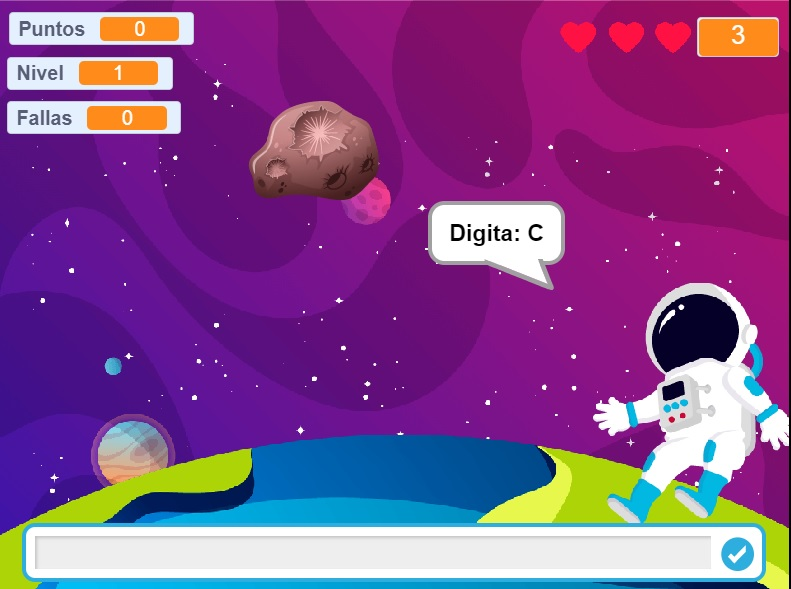

# Letras Espaciales 🎮
## Misión Letras Espaciales es un juego creado para niños, consiste en el aprendizaje de letras, palabras y sumas usando el teclado ⌨ 🎮
### Puedes jugar en https://misionletras.web.app/
### El juego ha sido diseñado en Scratch, y convertido a formato HTML y JavaScript gracias a https://forkphorus.github.io/ 
### Recurso disponible en Scratch https://scratch.mit.edu/projects/350573763/  
### Preview

 

 
<strong>SUPPORT this project</strong> 
 

